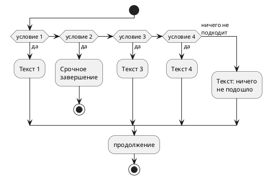

# Диаграмма активности



```puml
@startuml

!theme plain
top to bottom direction
skinparam linetype ortho

class actor {
first_name: varchar(45)
last_name: varchar(45)
last_update: timestamp
actor_id: smallint unsigned
}
class node16 as "actor_1  /* backup table */" {
actor_id: smallint unsigned
first_name: varchar(45)
last_name: varchar(45)
last_update: timestamp
column_nameimg: blob
}
class actor_info {
actor_id: smallint unsigned
first_name: varchar(45)
last_name: varchar(45)
film_info: text
}
class address {
address: varchar(50)
address2: varchar(50)
district: varchar(20)
city_id: smallint unsigned
postal_code: varchar(10)
phone: varchar(20)
last_update: timestamp
address_id: smallint unsigned
}
class category {
name: varchar(25)
last_update: timestamp
category_id: tinyint unsigned
}
class city {
city: varchar(50)
country_id: smallint unsigned
last_update: timestamp
city_id: smallint unsigned
}
class country {
country: varchar(50)
last_update: timestamp
country_id: smallint unsigned
}
class customer {
store_id: tinyint unsigned
first_name: varchar(45)
last_name: varchar(45)
email: varchar(50)
address_id: smallint unsigned
active: tinyint(1)
create_date: datetime
last_update: timestamp
customer_id: smallint unsigned
}
class customer_list {
ID: smallint unsigned
name: varchar(91)
address: varchar(50)
zip code: varchar(10)
phone: varchar(20)
city: varchar(50)
country: varchar(50)
notes: varchar(6)
SID: tinyint unsigned
}
class film {
title: varchar(255)
description: text
release_year: year
language_id: tinyint unsigned
original_language_id: tinyint unsigned
rental_duration: tinyint unsigned
rental_rate: decimal(4,2)
length: smallint unsigned
replacement_cost: decimal(5,2)
rating: enum('g', 'pg', 'pg-13', 'r', 'nc-17')
special_features: set('trailers', 'commentaries', 'deleted scenes', 'behind the scenes')
last_update: timestamp
film_id: smallint unsigned
}
class film_actor {
last_update: timestamp
actor_id: smallint unsigned
film_id: smallint unsigned
}
class film_category {
last_update: timestamp
film_id: smallint unsigned
category_id: tinyint unsigned
}
class film_text {
title: varchar(255)
description: text
film_id: smallint
}
class inventory {
film_id: smallint unsigned
store_id: tinyint unsigned
last_update: timestamp
inventory_id: mediumint unsigned
}
class language {
name: char(20)
last_update: timestamp
language_id: tinyint unsigned
}
class payment {
customer_id: smallint unsigned
staff_id: tinyint unsigned
rental_id: int
amount: decimal(5,2)
payment_date: datetime
last_update: timestamp
payment_id: smallint unsigned
}
class pet {
pet: varchar(150)
name: varchar(150)
owner: varchar(150)
}
class rental {
rental_date: datetime
inventory_id: mediumint unsigned
customer_id: smallint unsigned
return_date: datetime
staff_id: tinyint unsigned
last_update: timestamp
rental_id: int
}
class sales_by_film_category {
category: varchar(25)
total_sales: decimal(27,2)
}
class sales_by_store {
store: varchar(101)
manager: varchar(91)
total_sales: decimal(27,2)
}
class staff {
first_name: varchar(45)
last_name: varchar(45)
address_id: smallint unsigned
picture: blob
email: varchar(50)
store_id: tinyint unsigned
active: tinyint(1)
username: varchar(16)
password: varchar(40)
last_update: timestamp
staff_id: tinyint unsigned
}
class staff_list {
ID: tinyint unsigned
name: varchar(91)
address: varchar(50)
zip code: varchar(10)
phone: varchar(20)
city: varchar(50)
country: varchar(50)
SID: tinyint unsigned
}
class store {
manager_staff_id: tinyint unsigned
address_id: smallint unsigned
last_update: timestamp
store_id: tinyint unsigned
}

address                 -[#595959,plain]-^  city                   : "city_id"
city                    -[#595959,plain]-^  country                : "country_id"
customer                -[#595959,plain]-^  address                : "address_id"
customer                -[#595959,plain]-^  store                  : "store_id"
film                    -[#595959,plain]-^  language               : "language_id"
film                    -[#595959,plain]-^  language               : "original_language_id:language_id"
film_actor              -[#595959,plain]-^  actor                  : "actor_id"
film_actor              -[#595959,plain]-^  film                   : "film_id"
film_category           -[#595959,plain]-^  category               : "category_id"
film_category           -[#595959,plain]-^  film                   : "film_id"
inventory               -[#595959,plain]-^  film                   : "film_id"
inventory               -[#595959,plain]-^  store                  : "store_id"
payment                 -[#595959,plain]-^  customer               : "customer_id"
payment                 -[#595959,plain]-^  rental                 : "rental_id"
payment                 -[#595959,plain]-^  staff                  : "staff_id"
rental                  -[#595959,plain]-^  customer               : "customer_id"
rental                  -[#595959,plain]-^  inventory              : "inventory_id"
rental                  -[#595959,plain]-^  staff                  : "staff_id"
staff                   -[#595959,plain]-^  address                : "address_id"
staff                   -[#595959,plain]-^  store                  : "store_id"
store                   -[#595959,plain]-^  address                : "address_id"
store                   -[#595959,plain]-^  staff                  : "manager_staff_id:staff_id"
@enduml