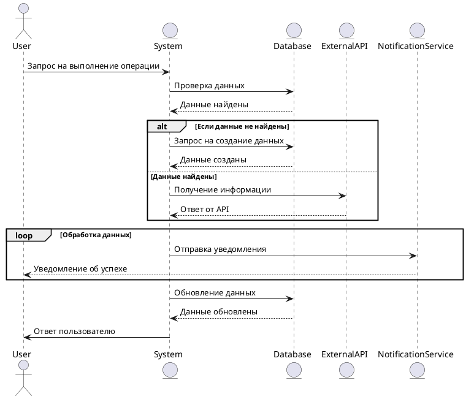

# Диаграмма последовательности

>Диаграмма последовательности (англ. sequence diagram) — UML-диаграмма, на которой для некоторого набора объектов на единой временной оси показан жизненный цикл объекта (создание-деятельность-уничтожение некой сущности) и взаимодействие акторов (действующих лиц) информационной системы в рамках прецедента

## Блокировка топливной карты - пример



<details>

<summary>Исходник кода</summary>

```
@startuml
actor User
entity System
entity Database
entity ExternalAPI
entity NotificationService

User -> System: Запрос на выполнение операции
System -> Database: Проверка данных
Database --> System: Данные найдены

alt Если данные не найдены
    System -> Database: Запрос на создание данных
    Database --> System: Данные созданы
else Данные найдены
    System -> ExternalAPI: Получение информации
    ExternalAPI --> System: Ответ от API
end

loop Обработка данных
    System -> NotificationService: Отправка уведомления
    NotificationService --> User: Уведомление об успехе
end

System -> Database: Обновление данных
Database --> System: Данные обновлены
System -> User: Ответ пользователю

@enduml
```

</details>


```dbml
Table users {
  id bigserial [pk]
  name varchar(100)
  email varchar(150) [unique]
}
Ref: users.id > orders.user_id

```


