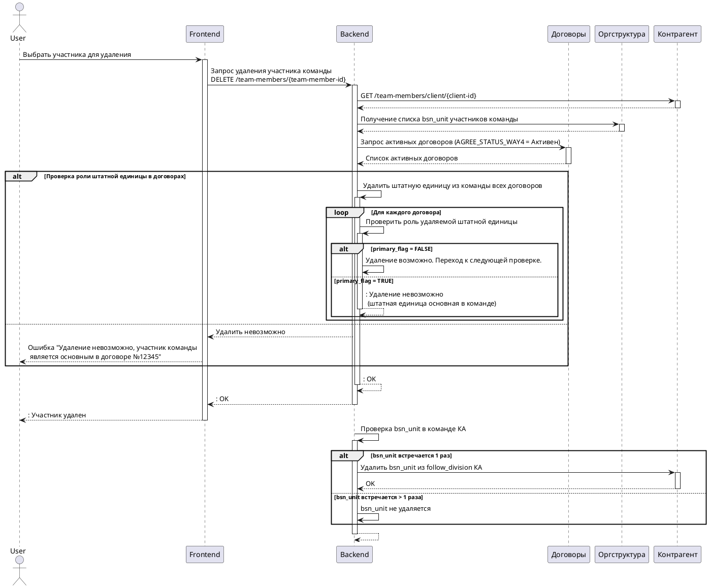

# Диаграмма последовательности

>Диаграмма последовательности (англ. sequence diagram) — UML-диаграмма, на которой для некоторого набора объектов на единой временной оси показан жизненный цикл объекта (создание-деятельность-уничтожение некой сущности) и взаимодействие акторов (действующих лиц) информационной системы в рамках прецедента

## Блокировка топливной карты - пример



<details>

<summary>Исходник кода</summary>

```
@startuml
actor User
participant "Frontend" as FE
participant "Backend" as BE
participant "Договоры" as Contracts
participant "Оргструктура" as Org
participant "Контрагент" as Counterparty

User -> FE ++: Выбрать участника для удаления
FE -> BE ++: Запрос удаления участника команды\nDELETE /team-members/{team-member-id}
BE -> Counterparty ++: GET /team-members/client/{client-id}
return
BE -> Org ++: Получение списка bsn_unit участников команды
return
BE -> Contracts ++: Запрос активных договоров (AGREE_STATUS_WAY4 = Активен)
return Список активных договоров

    alt Проверка роли штатной единицы в договорах
        BE -> BE++: Удалить штатную единицу из команды всех договоров
            loop Для каждого договора
                BE -> BE++: Проверить роль удаляемой штатной единицы
        
            alt primary_flag = FALSE
                BE -> BE: Удаление возможно. Переход к следующей проверке.
            else primary_flag = TRUE
            return: Удаление невозможно\n (штатная единица основная в команде)
            end
        
        end

    else
        BE --> FE: Удалить невозможно
        FE --> User: Ошибка "Удаление невозможно, участник команды \n является основным в договоре №12345"
    end

return: OK
return: OK
return: Участник удален
BE -> BE ++: Проверка bsn_unit в команде КА

    alt bsn_unit встречается 1 раз
        BE -> Counterparty ++: Удалить bsn_unit из follow_division КА
        return OK
        else bsn_unit встречается > 1 раза
        BE -> BE: bsn_unit не удаляется
    end

return
@enduml
```

</details>


