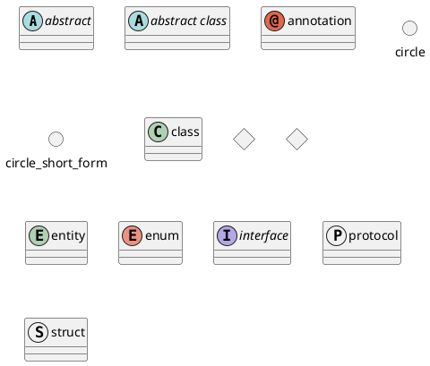

# Диаграмма классов 

> Диаграммы классов строятся с использованием синтаксиса, повторяющего синтаксис, традиционно используемый в языках программирования. Такое сходство создает привычную среду для разработчиков, что способствует более легкому и интуитивно понятному процессу создания диаграмм.
> Такой подход к проектированию не только лаконичен, но и позволяет создавать представления, которые одновременно лаконичны и выразительны. Более того, он позволяет изображать отношения между классами с помощью синтаксиса, повторяющего синтаксис диаграмм последовательности, 
> что открывает путь к плавному и глубокому изображению взаимодействия классов


### Таким образом надо занять немного места на странице

###Так диаграмма выглядит под капотом.

 

    а картинки, оказывается можно достаточно просто вставлять
``` 
    @startuml
    abstract        abstract
    abstract class  "abstract class"
    annotation      annotation
    circle          circle
    ()              circle_short_form
    class           class
    diamond         diamond
    <>              diamond_short_form
    entity          entity
    enum            enum
    interface       interface
    protocol        protocol
    struct          struct
    @enduml
```
### Пример скрывающего списка
<details>
  <summary>Немного скрывающихся списков</summary>
  <b>WOW, SO BOLD</b>
</details>


### Вложенные скрывающиеся списки - матрешка

<details open>
<summary>Section A</summary>
<details>
<summary>Section A.B</summary>
<details>
<summary>Section A.B.C</summary>
<details>
<summary>Section A.B.C.D</summary>
  Done!
</details>
</details>
</details>
</details>

## Тестовая ссылка для установки якоря
#anchor

Текст на странице.

[Перейти к якорю](#anchor)
