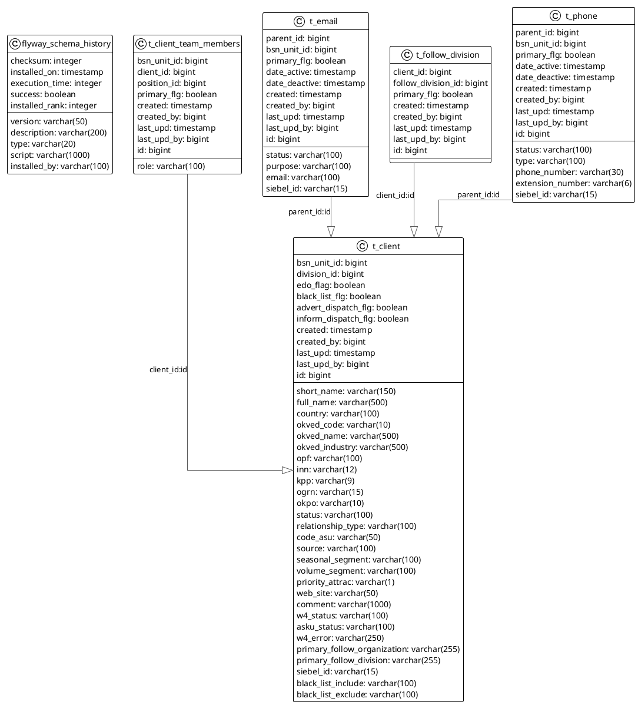

```puml
@startuml

!theme plain
top to bottom direction
skinparam linetype ortho

class flyway_schema_history {
version: varchar(50)
description: varchar(200)
type: varchar(20)
script: varchar(1000)
checksum: integer
installed_by: varchar(100)
installed_on: timestamp
execution_time: integer
success: boolean
installed_rank: integer
}
class t_client {
short_name: varchar(150)
full_name: varchar(500)
country: varchar(100)
okved_code: varchar(10)
okved_name: varchar(500)
okved_industry: varchar(500)
opf: varchar(100)
inn: varchar(12)
kpp: varchar(9)
ogrn: varchar(15)
okpo: varchar(10)
status: varchar(100)
relationship_type: varchar(100)
bsn_unit_id: bigint
division_id: bigint
code_asu: varchar(50)
source: varchar(100)
seasonal_segment: varchar(100)
volume_segment: varchar(100)
priority_attrac: varchar(1)
web_site: varchar(50)
comment: varchar(1000)
w4_status: varchar(100)
asku_status: varchar(100)
w4_error: varchar(250)
primary_follow_organization: varchar(255)
primary_follow_division: varchar(255)
edo_flag: boolean
black_list_flg: boolean
advert_dispatch_flg: boolean
inform_dispatch_flg: boolean
siebel_id: varchar(15)
black_list_include: varchar(100)
black_list_exclude: varchar(100)
created: timestamp
created_by: bigint
last_upd: timestamp
last_upd_by: bigint
id: bigint
}
class t_client_team_members {
bsn_unit_id: bigint
client_id: bigint
position_id: bigint
role: varchar(100)
primary_flg: boolean
created: timestamp
created_by: bigint
last_upd: timestamp
last_upd_by: bigint
id: bigint
}
class t_email {
status: varchar(100)
parent_id: bigint
bsn_unit_id: bigint
primary_flg: boolean
purpose: varchar(100)
email: varchar(100)
date_active: timestamp
date_deactive: timestamp
siebel_id: varchar(15)
created: timestamp
created_by: bigint
last_upd: timestamp
last_upd_by: bigint
id: bigint
}
class t_follow_division {
client_id: bigint
follow_division_id: bigint
primary_flg: boolean
created: timestamp
created_by: bigint
last_upd: timestamp
last_upd_by: bigint
id: bigint
}
class t_phone {
status: varchar(100)
parent_id: bigint
bsn_unit_id: bigint
type: varchar(100)
phone_number: varchar(30)
extension_number: varchar(6)
primary_flg: boolean
date_active: timestamp
date_deactive: timestamp
siebel_id: varchar(15)
created: timestamp
created_by: bigint
last_upd: timestamp
last_upd_by: bigint
id: bigint
}

t_client_team_members  -[#595959,plain]-^  t_client              : "client_id:id"
t_email                -[#595959,plain]-^  t_client              : "parent_id:id"
t_follow_division      -[#595959,plain]-^  t_client              : "client_id:id"
t_phone                -[#595959,plain]-^  t_client              : "parent_id:id"
@enduml
```