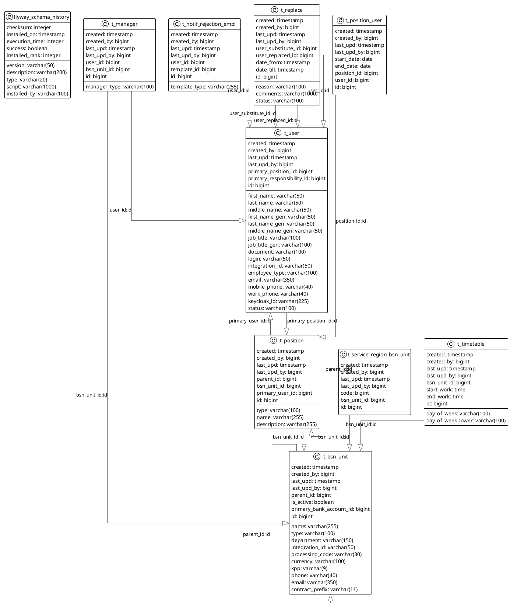

```puml
@startuml

!theme plain
top to bottom direction
skinparam linetype ortho

class flyway_schema_history {
   version: varchar(50)
   description: varchar(200)
   type: varchar(20)
   script: varchar(1000)
   checksum: integer
   installed_by: varchar(100)
   installed_on: timestamp
   execution_time: integer
   success: boolean
   installed_rank: integer
}
class t_bsn_unit {
   created: timestamp
   created_by: bigint
   last_upd: timestamp
   last_upd_by: bigint
   parent_id: bigint
   name: varchar(255)
   type: varchar(100)
   department: varchar(150)
   integration_id: varchar(50)
   processing_code: varchar(30)
   currency: varchar(100)
   kpp: varchar(9)
   phone: varchar(40)
   email: varchar(350)
   is_active: boolean
   primary_bank_account_id: bigint
   contract_prefix: varchar(11)
   id: bigint
}
class t_manager {
   created: timestamp
   created_by: bigint
   last_upd: timestamp
   last_upd_by: bigint
   manager_type: varchar(100)
   user_id: bigint
   bsn_unit_id: bigint
   id: bigint
}
class t_notif_rejection_empl {
   created: timestamp
   created_by: bigint
   last_upd: timestamp
   last_upd_by: bigint
   user_id: bigint
   template_id: bigint
   template_type: varchar(255)
   id: bigint
}
class t_position {
   created: timestamp
   created_by: bigint
   last_upd: timestamp
   last_upd_by: bigint
   parent_id: bigint
   type: varchar(100)
   name: varchar(255)
   description: varchar(255)
   bsn_unit_id: bigint
   primary_user_id: bigint
   id: bigint
}
class t_position_user {
   created: timestamp
   created_by: bigint
   last_upd: timestamp
   last_upd_by: bigint
   start_date: date
   end_date: date
   position_id: bigint
   user_id: bigint
   id: bigint
}
class t_replace {
   created: timestamp
   created_by: bigint
   last_upd: timestamp
   last_upd_by: bigint
   user_substitute_id: bigint
   user_replaced_id: bigint
   date_from: timestamp
   date_till: timestamp
   reason: varchar(100)
   comments: varchar(1000)
   status: varchar(100)
   id: bigint
}
class t_service_region_bsn_unit {
   created: timestamp
   created_by: bigint
   last_upd: timestamp
   last_upd_by: bigint
   code: bigint
   bsn_unit_id: bigint
   id: bigint
}
class t_timetable {
   created: timestamp
   created_by: bigint
   last_upd: timestamp
   last_upd_by: bigint
   bsn_unit_id: bigint
   day_of_week: varchar(100)
   day_of_week_lower: varchar(100)
   start_work: time
   end_work: time
   id: bigint
}
class t_user {
   created: timestamp
   created_by: bigint
   last_upd: timestamp
   last_upd_by: bigint
   first_name: varchar(50)
   last_name: varchar(50)
   middle_name: varchar(50)
   first_name_gen: varchar(50)
   last_name_gen: varchar(50)
   middle_name_gen: varchar(50)
   primary_position_id: bigint
   job_title: varchar(100)
   job_title_gen: varchar(100)
   document: varchar(100)
   primary_responsibility_id: bigint
   login: varchar(50)
   integration_id: varchar(50)
   employee_type: varchar(100)
   email: varchar(350)
   mobile_phone: varchar(40)
   work_phone: varchar(40)
   keycloak_id: varchar(225)
   status: varchar(100)
   id: bigint
}

t_bsn_unit                 -[#595959,plain]-^  t_bsn_unit                : "parent_id:id"
t_manager                  -[#595959,plain]-^  t_bsn_unit                : "bsn_unit_id:id"
t_manager                  -[#595959,plain]-^  t_user                    : "user_id:id"
t_notif_rejection_empl     -[#595959,plain]-^  t_user                    : "user_id:id"
t_position                 -[#595959,plain]-^  t_bsn_unit                : "bsn_unit_id:id"
t_position                 -[#595959,plain]-^  t_position                : "parent_id:id"
t_position                 -[#595959,plain]-^  t_user                    : "primary_user_id:id"
t_position_user            -[#595959,plain]-^  t_position                : "position_id:id"
t_position_user            -[#595959,plain]-^  t_user                    : "user_id:id"
t_replace                  -[#595959,plain]-^  t_user                    : "user_substitute_id:id"
t_replace                  -[#595959,plain]-^  t_user                    : "user_replaced_id:id"
t_service_region_bsn_unit  -[#595959,plain]-^  t_bsn_unit                : "bsn_unit_id:id"
t_timetable                -[#595959,plain]-^  t_bsn_unit                : "bsn_unit_id:id"
t_user                     -[#595959,plain]-^  t_position                : "primary_position_id:id"
@enduml

```