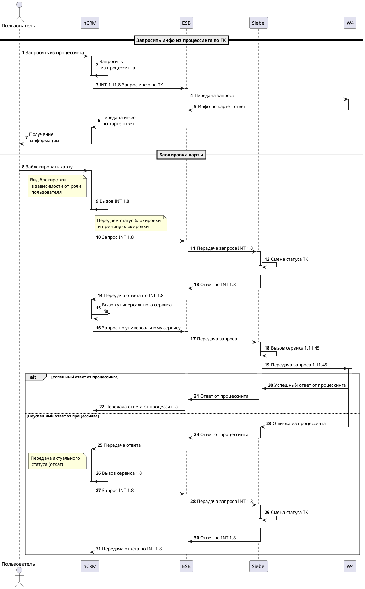

# Heading

```puml
@startuml
autonumber
actor Пользователь
participant "nCRM" as A
participant "ESB" as B
participant "Siebel" as C
participant "W4" as D
==Запросить инфо из процессинга по ТК==
Пользователь -> A: Запросить из процессинга
activate A
A -> A: Запросить\n из процессинга
activate A
A -> B: INT 1.11.8 Запрос инфо по ТК
activate B
B -> D: Передача запроса
activate D
D -> B: Инфо по карте - ответ
deactivate D
B -> A: Передача инфо\n по карте ответ
deactivate A
deactivate B
A -> Пользователь: Получение\n информации
deactivate A
==Блокировка карты==
Пользователь -> A: Заблокировать карту
note left of A: Вид блокировки\n в зависимости от роли\n пользователя
activate A
A -> A: Вызов INT 1.8
note right of A: Передаем статус блокировки \n и причину блокировки
activate A
A -> B: Запрос INT 1.8
activate B
B -> C: Перадача запроса INT 1.8
activate C
C -> C: Смена статуса ТК
activate C
deactivate C
C -> B: Ответ по INT 1.8
deactivate C
B -> A: Передача ответа по INT 1.8
deactivate B
deactivate A
A -> A: Вызов универсального сервиса \n №_____
activate A
A -> B: Запрос по универсальному сервису
activate B
B -> C: Передача запроса
activate C
C -> C: Вызов сервиса 1.11.45
activate C
C -> D: Передача запроса 1.11.45
activate D
alt Успешный ответ от процессинга
D -> C: Успешный ответ от процессинга
C -> B: Ответ от процессинга
B -> A: Передача ответа от процессинга
else Неуспешный ответ от процессинга
D -> C: Ошибка из процессинга
deactivate D
deactivate C
C -> B: Ответ от процессинга
deactivate C
B -> A: Передача ответа
deactivate B
deactivate A
note left of A: Передача актуального \n статуса (откат)
A -> A: Вызов сервиса 1.8
activate A
A -> B: Запрос INT 1.8
activate B
B -> C: Перадача запроса INT 1.8
activate C
C -> C: Смена статуса ТК
activate C
deactivate C
C -> B: Ответ по INT 1.8
deactivate C
B -> A: Передача ответа по INT 1.8
deactivate B
deactivate A
deactivate A
end
@enduml
```

## Heading 2