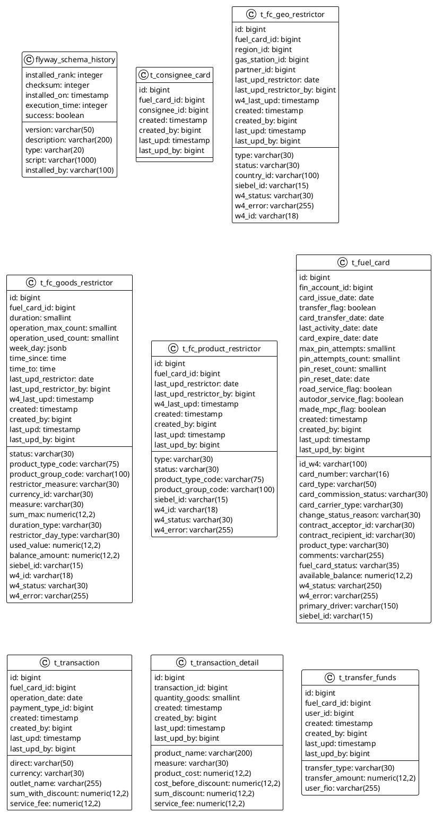

# Здесь могла бы быть ваша реклама

For full documentation visit [mkdocs.org](https://www.mkdocs.org).

    Это тестовый стенд, который поднят для проверки возможностей Mkdocs

## Проверка отображения заголовка №2
[Переход на страницу диаграмм](Group-1/diagram-sequence.md)

[И еще одна ссылка](Group-1/diagramm_classes.md)

